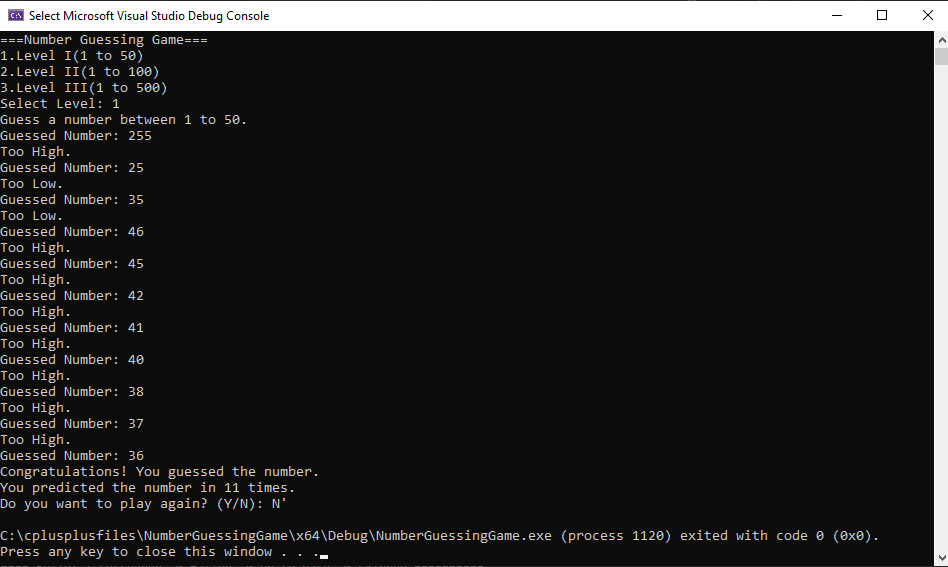

# Number Guessing Game

A console-based Number Guessing Game written in C++. The program generates a random number based on the selected difficulty level, and the player must guess it using the provided hints.

## Features

* Three difficulty levels

  * Level I: 1–50
  * Level II: 1–100
  * Level III: 1–500
* Random number generation
* Attempt counter
* "Too High" and "Too Low" hints
* Play Again option
* Input validation for invalid and non-numeric input
* Simple console-based interface

## Sample Output

```text
=== Number Guessing Game ===
1. Level I (1 to 50)
2. Level II (1 to 100)
3. Level III (1 to 500)

Select Level: 1
Guess a number between 1 to 50.
Guessed Number: 25
Too High.
Guessed Number: 12
Too Low.
Guessed Number: 18
Congratulations! You guessed the number.
You predicted the number in 3 attempts.
```

## Screenshot




## License

This project is licensed under the MIT License.

---

This project was created to practice C++ fundamentals, including random number generation, loops, conditional statements, and input validation.
